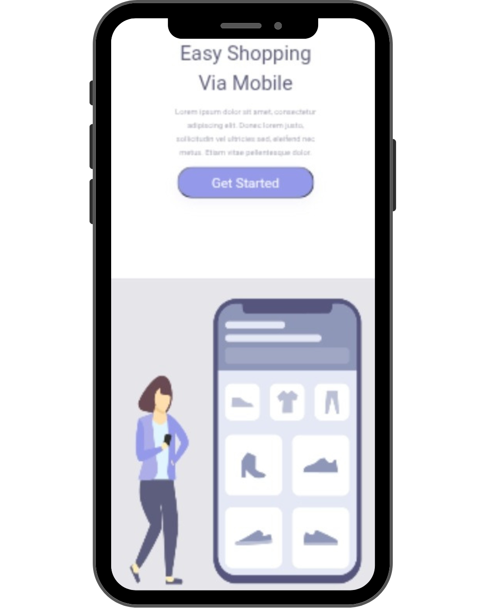

# Projeto: Easy Shopping Responsivo

Este é um projeto de uma loja virtual desenvolvida em 
 e 
. O projeto foi feito como desafio para testar os conhecimentos adquiridos no <a href="https://rodolfomori.com.br/devclub">DevClub</a> sobre responsividade.

## 🚀 Tecnologias Utiizadas
- HTML5
- CSS3
- JavaScript
- Git & GitHub

## 🎯 Layout do projeto

  
  

## ✅ Projeto finalizado

## 🧑‍💻 Desenvolvido por

Hudson Júnior  
[LinkedIn](https://linkedin.com/in/ohudsonjunior) • [GitHub](https://github.com/hudson-junior)
